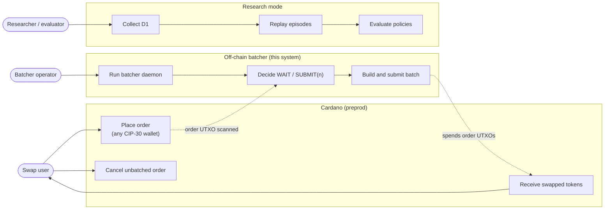
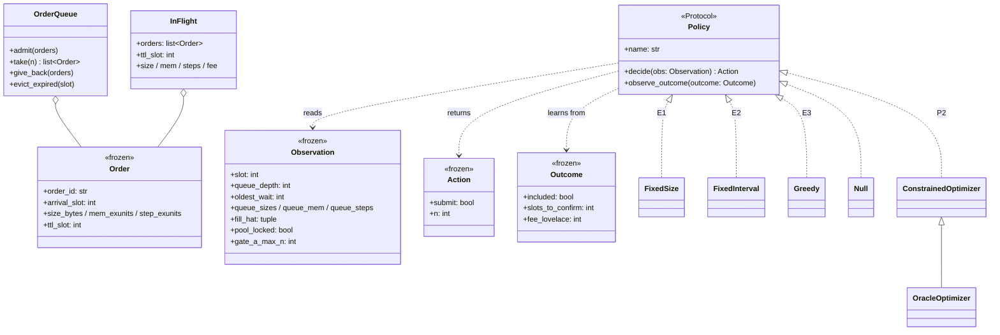
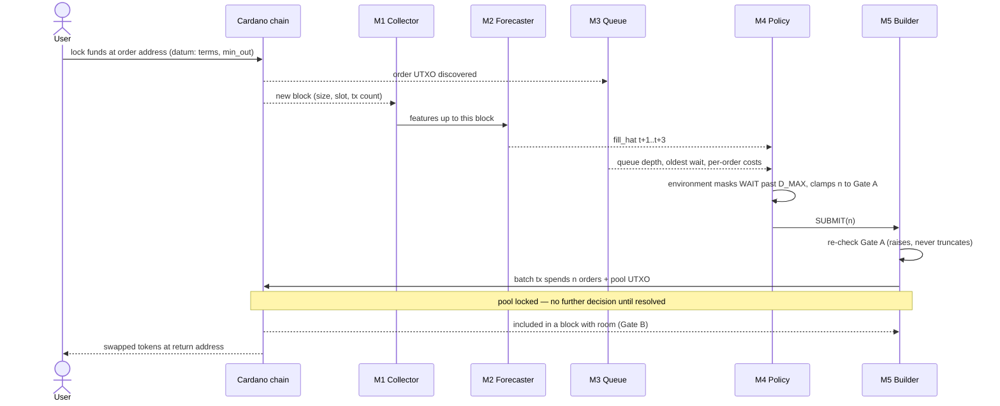
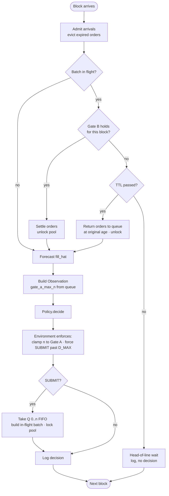
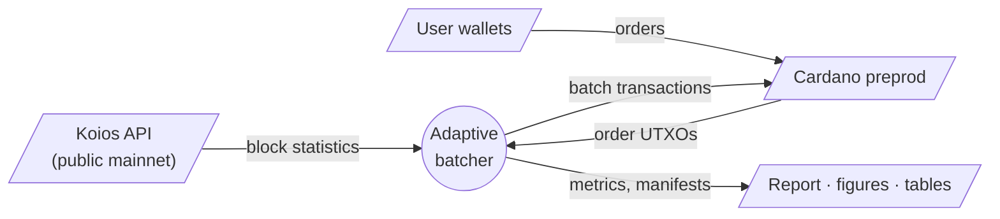
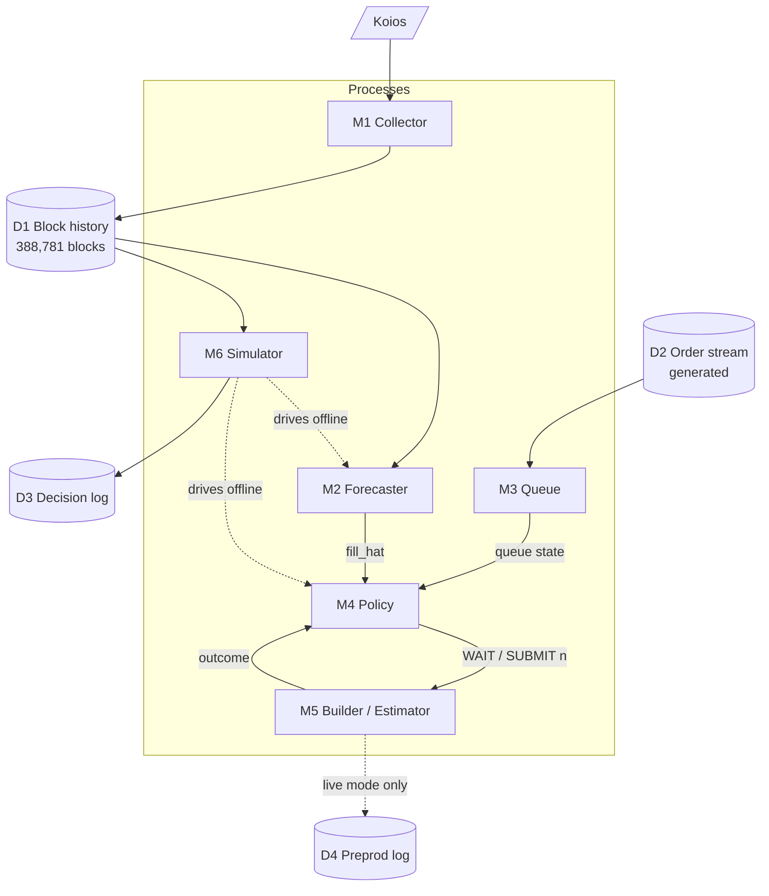
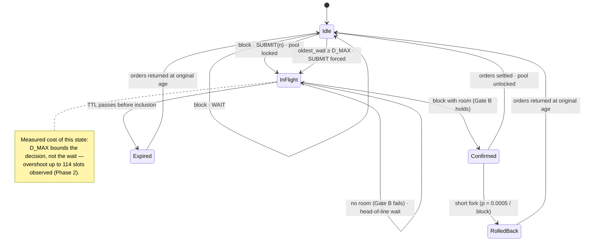
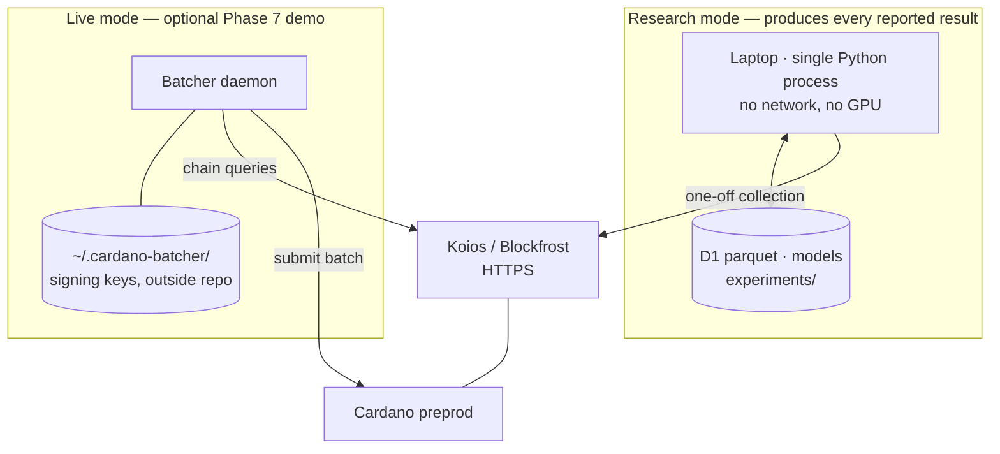

# Report diagrams (P6-12)

The eight diagrams `16-REPORT-OUTLINE.md` §5.10 asks for, drawn from the code as
built rather than from the original design. Where the implementation diverged
from the specification, the diagram follows the implementation and says so.

Mermaid sources render directly on GitHub and in most Markdown viewers, and can be
exported to PNG for a Word report.

---

## 1 · Use case

The swap user never interacts with the batcher. The two are coupled only through
order UTXOs on chain — the reason there is no frontend.

---

## 2 · Class

The interfaces that make the comparison honest: every policy sees the same
`Observation` and returns the same `Action`, so the simulator cannot tell a static
rule from a learned agent.

P3 is not a `Policy` subclass: the DQN agent acts through `BatchingEnv`, the
Gymnasium wrapper around the same event loop, and is scored through the same
metrics path.

---

## 3 · Sequence

One order from placement to settlement.

---

## 4 · Activity — the control loop, one block

The early exit while the pool is locked is the mechanism the project studies:
while a batch is in flight, **no decision exists**.

---

## 5 · Data flow, level 0

---

## 6 · Data flow, level 1

---

## 7 · State — the pool lock

The diagram the outline singles out. A submitted batch holds the pool UTXO; every
order that arrives meanwhile waits behind it. Note what is **absent**: there is no
"rejected" or "bounced" state. A batch that does not fit a block stays in the
mempool and is retried against the next one (ADR-004).

*Implementation note.* The simulator models rollback; the Gym environment P3 trains
in does not. It is a small asymmetry (p = 0.0005 per block) and is recorded in the
Phase 6 evaluation manifest.

---

## 8 · Deployment

No inbound ports, no database server, no user-facing endpoint in either mode.
